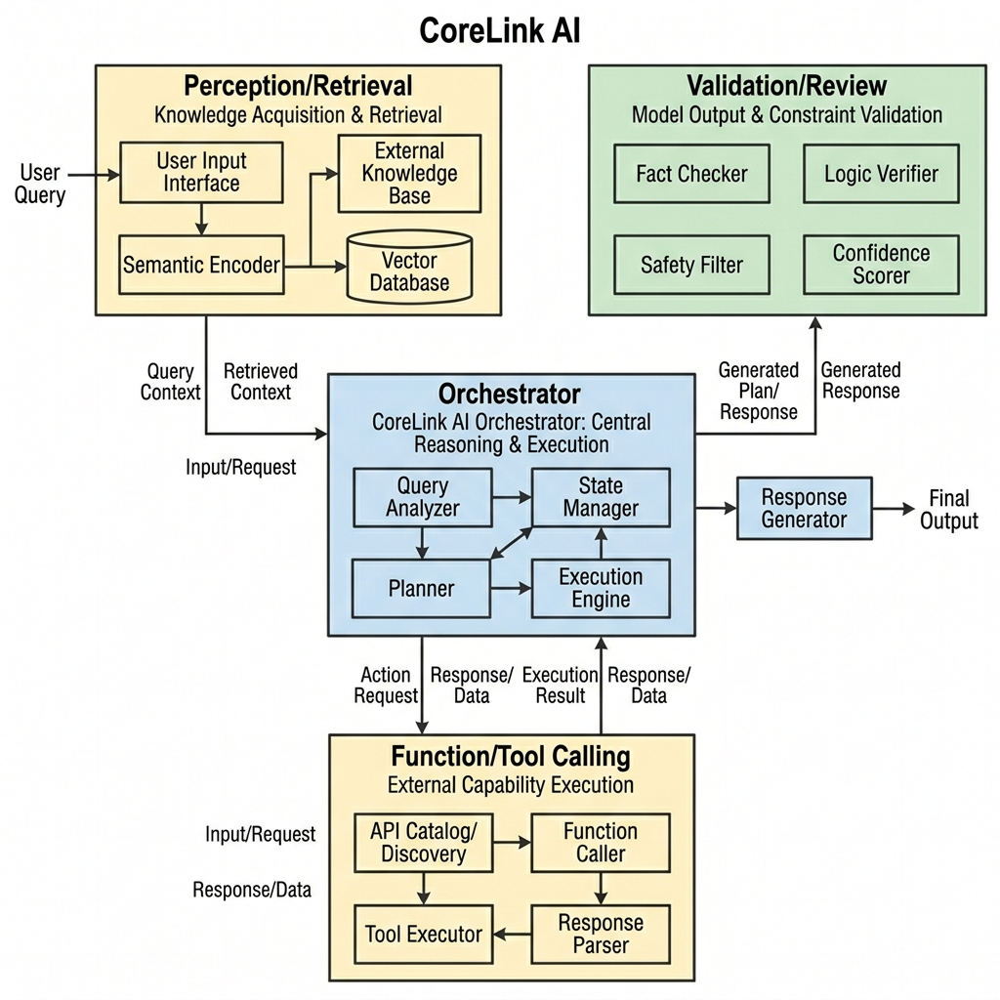

# CoreLink AI

CoreLink AI is a modular reasoning engine for evidence-grounded analytical tasks. It is designed for workflows where correctness depends on retrieving the right evidence, applying the right strategy, and producing auditable outputs instead of unconstrained model guesses.

The runtime combines adaptive retrieval, structured evidence extraction, deterministic compute, bounded model-controlled recovery, and explicit answerability policy. It is built for tool-using agents that need to search, compute, validate, and stop safely.

<p align="center">
  
</p>

## Why CoreLink AI

Most agent systems break in one of two ways:

- they over-trust model recall and answer without enough evidence
- they add tools, but lack policy around when to search, retry, compute, recover, or stop

CoreLink AI is built to close that gap. It favors evidence over recall, deterministic execution over free-form math, and typed recovery paths over unbounded loops.

## Core Capabilities

- **Adaptive retrieval strategies**: The runtime selects and rotates retrieval strategies such as table-first, text-first, hybrid, and multi-document search based on question shape and runtime feedback.
- **LLM-guided evidence arbitration**: Models are used as bounded selectors over shortlisted candidates instead of as unconstrained answer generators.
- **Structured evidence extraction**: Retrieved material is normalized into typed evidence that can be validated and computed over.
- **Deterministic compute first**: Numeric answers are produced through deterministic logic whenever the evidence supports it.
- **Lightweight capability acquisition for compute**: When native deterministic compute is insufficient, the runtime can synthesize a small deterministic function, validate it in a constrained sandbox, and use it as a bounded fallback.
- **Cross-task strategy journal**: The runtime records strategy outcomes and uses recent success and failure patterns as priors for later tasks in the same process.
- **Repair and regime mutation**: When a path fails, the system can rotate strategies, widen the search regime, or restart from a different evidence path instead of repeating the same loop.
- **Answerability policy**: Failure answers are treated as a controlled terminal state, not as a casual fallback.

## How It Works

At a high level, CoreLink AI follows this flow:

1. **Plan the task**
   - Parse the query into a semantic contract: what needs to be found, computed, compared, or aggregated.
2. **Select a retrieval strategy**
   - Choose the best initial strategy based on question shape, constraints, and prior journal outcomes.
3. **Generate and shortlist candidates**
   - Search for relevant documents, tables, or evidence units.
4. **Arbitrate the evidence**
   - Use bounded model selection to choose the best visible candidate set.
5. **Extract structured evidence**
   - Normalize the chosen material into a form suitable for deterministic reasoning.
6. **Compute**
   - Run native deterministic compute when supported.
   - If needed, synthesize a constrained compute function and validate it before use.
7. **Validate**
   - Check evidence fit, compute validity, and answerability policy.
8. **Recover or finish**
   - If the result is weak, rotate strategy or mutate the retrieval regime.
   - If the result is strong, emit the final answer.

## Architecture

The V6 runtime centers around a few stable boundaries:

- **Semantic planning**
  - captures the contract of the task before retrieval starts
- **Strategy kernel**
  - selects retrieval strategy and manages strategy rotation
- **Candidate generation and tool runtime**
  - performs document and evidence discovery
- **Evidence arbitration**
  - chooses the best candidate set from shortlisted options
- **Structured extraction**
  - converts raw retrieval outputs into compute-ready evidence
- **Deterministic and synthesized compute**
  - executes validated calculations against structured evidence
- **Validation and recovery**
  - decides whether to finalize, revise, rotate strategy, or stop

This architecture is designed to keep the runtime modular, auditable, and recoverable under failure.

## Getting Started

### Prerequisites

- Python 3.13+
- `uv`
- Git
- an OpenAI-compatible API key

### Clone the repository

```bash
git clone https://github.com/krishna-dhulipalla/CoreLink-AI.git
cd CoreLink-AI
```

### Install dependencies

```bash
uv sync
```

### Configure environment variables

Create a local environment file:

```bash
cp .env.example .env
```

At minimum, set your provider credentials:

```ini
OPENAI_API_KEY=your_key_here
OPENAI_BASE_URL=your_base_url_if_needed
```

## Running CoreLink AI

### Start the server

```bash
uv run python -m engine.a2a.server --host 127.0.0.1 --port 9009
```

### Run a local engine smoke test

```bash
uv run python scripts/run_live_engine_smoke.py
```

### Run the test suite

```bash
uv run pytest tests -q -p no:cacheprovider
```

## Configuration

CoreLink AI is configured through environment variables in `.env`.

Common settings include:

- **Provider credentials**
  - `OPENAI_API_KEY`
  - `OPENAI_BASE_URL`
- **Model routing**
  - solver, reviewer, arbitration, and compute-capability model overrides
- **Runtime limits**
  - tool-call budgets
  - revise budgets
  - context limits
- **Optional behavior flags**
  - policy switches for retrieval, repair, and bounded fallback paths

## Evaluation

The repository includes benchmark and smoke-test harnesses used to harden the runtime under document-heavy analytical tasks.

Example:

```bash
uv run python scripts/run_officeqa_regression.py --smoke
```

These evaluations are useful for regression testing, but CoreLink AI is not tied to a single benchmark. The architecture is intended to generalize to other evidence-grounded reasoning tasks.

## Project Layout

```text
CoreLink-AI/
├── src/
│   ├── engine/
│   │   ├── a2a/          # Server and messaging layer
│   │   ├── mcp/          # MCP integration
│   │   ├── runtime/      # Shared runtime utilities
│   │   └── agent/        # Core reasoning engine
├── scripts/              # Smoke, eval, and maintenance scripts
├── tests/                # Unit and regression tests
├── assets/               # Static assets
├── pyproject.toml
└── Dockerfile
```

## License

See [LICENSE](LICENSE).
