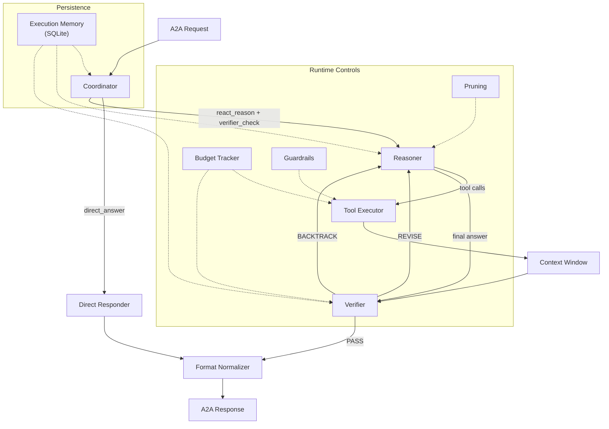

# CoreLink AI

General-purpose A2A reasoning engine built on LangGraph and MCP. The core runtime is domain-agnostic; domain capability comes from MCP servers discovered at startup.

## Architecture



### Key Components

| Component             | Role                                                                              |
| --------------------- | --------------------------------------------------------------------------------- |
| **Coordinator**       | Chooses execution plan (`direct_answer` or `react_reason → verifier_check`)       |
| **Reasoner**          | Tool-enabled LLM reasoning loop                                                   |
| **Tool Executor**     | Runs tools, truncates output, applies guardrails                                  |
| **Verifier**          | Step-level gate: `PASS`, `REVISE`, or `BACKTRACK`                                 |
| **Context Window**    | Trims long histories while preserving tool-call adjacency                         |
| **Format Normalizer** | Final formatting pass (JSON/XML if needed)                                        |
| **Execution Memory**  | SQLite-backed hints for routing, tool selection, and repair strategies            |
| **Pruning**           | Strips stale tool results and memory hints before LLM calls                       |
| **Budget Tracker**    | Caps tool calls (15), revise (3), backtrack (2), hint tokens (200)                |
| **Guardrails**        | Prompt-injection detection, tool-description validation, external-content tagging |

## Repository Layout

```text
src/
  server.py                 A2A server entrypoint
  executor.py               A2A <-> LangGraph bridge
  context_manager.py        token counting and message windowing
  conversation_store.py     multi-turn conversation storage
  mcp_client.py             MCP tool loading
  tools.py                  built-in calculator/search/time tools
  agent/
    graph.py                graph construction
    runner.py               run wrapper and cost/budget summaries
    state.py                shared state schema
    prompts.py              prompts and structured outputs
    cost.py                 token/cost accounting
    budget.py               per-run budget enforcement
    pruning.py              state pruning at node boundaries
    guardrails.py           content sanitization and validation
    operators.py            operator registry and defaults
    memory/                 SQLite-backed execution memory
    nodes/                  coordinator, reasoner, verifier, formatter, context
  mcp_servers/              local MCP servers

tests/
docs/
```

## Setup

```bash
uv sync
```

Create `.env` with your keys:

```env
OPENAI_API_KEY=...
MODEL_NAME=gpt-4o-mini
TAVILY_API_KEY=
MCP_SERVER_STDIO=
MCP_SERVER_URLS=
```

## Run

```bash
uv run python src/server.py
uv run python src/server.py --port 9010  # custom port
```

## Tests

```bash
uv run pytest tests -v        # full suite
uv run pytest tests -v -x     # stop on first failure
```

## Notes

- Built-in tools and MCP tools are both available to the runtime.
- Budget caps are env-configurable (`MAX_TOOL_CALLS`, `MAX_REVISE_CYCLES`, `MAX_BACKTRACK_CYCLES`, `MAX_HINT_TOKENS`).
- Execution memory uses compact exact-match task signatures in SQLite with near-duplicate suppression.
- Multi-turn conversation history is reused through A2A `context_id`.
