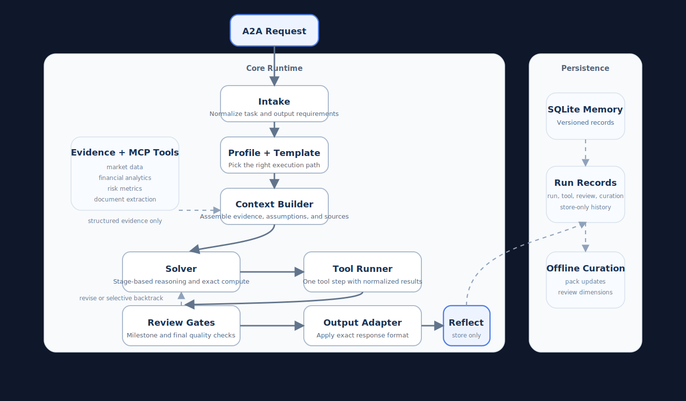

# CoreLink AI

CoreLink AI is a staged A2A reasoning engine built for finance-first workflows on top of LangGraph and MCP. The runtime is designed to give general models structured context at each step instead of forcing one large prompt to handle routing, tool use, reasoning, review, and formatting all at once.

## Architecture



The active request path is:

```text
A2A Request
  -> intake
  -> task_profiler
  -> template_selector
  -> context_builder
  -> solver
       -> tool_runner -> solver
       -> reviewer
  -> output_adapter
  -> reflect
```

## Node Responsibilities

| Node | Responsibility |
| --- | --- |
| `intake` | Normalizes the incoming request and extracts output-format requirements into an `AnswerContract`. |
| `task_profiler` | Chooses a coarse `task_profile` and additive `capability_flags` without overcommitting to one brittle route. |
| `template_selector` | Maps the profile decision to a static execution template with explicit stage, tool, and review policy. |
| `context_builder` | Builds a typed `EvidencePack` from prompt facts, formulas, tables, file references, and derived domain signals. |
| `solver` | Runs stage-based reasoning across `PLAN`, `GATHER`, `COMPUTE`, `SYNTHESIZE`, `REVISE`, and `COMPLETE`. |
| `tool_runner` | Executes one allowed tool call and normalizes the result into a structured `ToolResult`. |
| `reviewer` | Reviews milestone and final artifacts only. It returns `pass`, `revise`, or `backtrack` plus missing dimensions. |
| `output_adapter` | Applies exact JSON or XML wrapping without changing the underlying reasoning. |
| `reflect` | Finalizes the run and writes compact execution memory to SQLite. |

## Runtime Artifacts

The runtime moves explicit artifacts between nodes:

- `task_profile`
- `capability_flags`
- `answer_contract`
- `evidence_pack`
- `solver_stage`
- `workpad`
- `pending_tool_call`
- `last_tool_result`
- `review_feedback`
- `profile_decision`
- `execution_template`
- `assumption_ledger`
- `provenance_map`

These contracts are defined in [src/agent/contracts.py](src/agent/contracts.py).

## How Context Is Supplied To The Model

CoreLink AI does not rely on one universal prompt manifesto. It builds context in layers:

1. `task_profiler` chooses a coarse domain profile such as `finance_quant`, `finance_options`, or `legal_transactional`.
2. `context_builder` merges that profile with the request itself to assemble an `EvidencePack`.
3. `solver` receives:
   - the current stage
   - the answer contract
   - the compact evidence pack
   - the last structured tool result
   - the current review feedback, if any

This keeps the model focused on the current stage rather than re-reading the full conversation on every turn.

## Tool Contract

Every tool result is normalized into the same shape before it goes back to the solver:

```json
{
  "type": "tool_name",
  "facts": {},
  "assumptions": {},
  "source": {},
  "errors": []
}
```

That normalization layer lives in [src/agent/tool_normalization.py](src/agent/tool_normalization.py).

## Persistence

Execution memory is written after each completed run into SQLite at `src/data/agent_memory.db`.

The active store is versioned and keeps staged-runtime records only:

- `run_memory`
- `tool_memory`
- `review_memory`
- `curation_memory`

If the on-disk schema is incompatible with the current runtime, it is reset automatically. The store implementation is in [src/agent/memory/store.py](src/agent/memory/store.py).

`curation_memory` is store-only. It exists to support offline profile-pack and template-policy curation and is not injected back into runtime prompts.

## Repository Layout

```text
src/
  server.py
  executor.py
  mcp_client.py
  tools.py
  agent/
    contracts.py
    graph.py
    runner.py
    runtime_support.py
    profile_packs.py
    tool_normalization.py
    state.py
    memory/
      curation.py
      schema.py
      store.py
    nodes/
      intake.py
      task_profiler.py
      template_selector.py
      context_builder.py
      solver.py
      tool_runner.py
      reviewer.py
      output_adapter.py
      reflect.py
  mcp_servers/
    finance/
    options_chain/
    file_handler/
    risk_metrics/
    trading_sim/

docs/
  architecture.svg
```

## Setup

Install dependencies:

```bash
uv sync
```

Create a `.env` file with your model and MCP settings:

```env
OPENAI_API_KEY=...
MODEL_PROFILE=balanced
MODEL_NAME=Qwen/Qwen3-32B-fast
STRUCTURED_OUTPUT_MODE=local_json
MCP_SERVER_STDIO=
MCP_SERVER_URLS=
```

## Run Locally

Start the A2A server:

```bash
uv run python src/server.py --port 9010
```

The agent card will be available at:

```text
http://127.0.0.1:9010/.well-known/agent-card.json
```

## Replicate The Runtime Locally

To reproduce the same staged runtime flow:

1. Install dependencies with `uv sync`.
2. Configure your model and any MCP servers in `.env`.
3. Start the server with `uv run python src/server.py --port 9010`.
4. Run the deterministic smoke check:

```bash
uv run python scripts/run_staged_runtime_smoke.py
```

5. If you want to exercise the live LLM and active MCP surface:

```bash
uv run python scripts/run_live_staged_smoke.py
```

## Tests

Run the full test suite:

```bash
uv run pytest tests -q
```

If you only want the staged-runtime core:

```bash
uv run pytest tests/test_staged_profiler.py tests/test_staged_context_builder.py tests/test_staged_solver.py tests/test_staged_tool_runner.py tests/test_staged_reviewer.py tests/test_staged_output_adapter.py -q
```

## Notes

- The previous coordinator/reasoner/verifier runtime is retired.
- Output formatting is handled by `output_adapter`, not by prompt-only instructions.
- External retrieval is opt-in based on explicit request signals, not a generic fallback.
- Execution memory is store-only in the current runtime and is not injected back into prompts.
