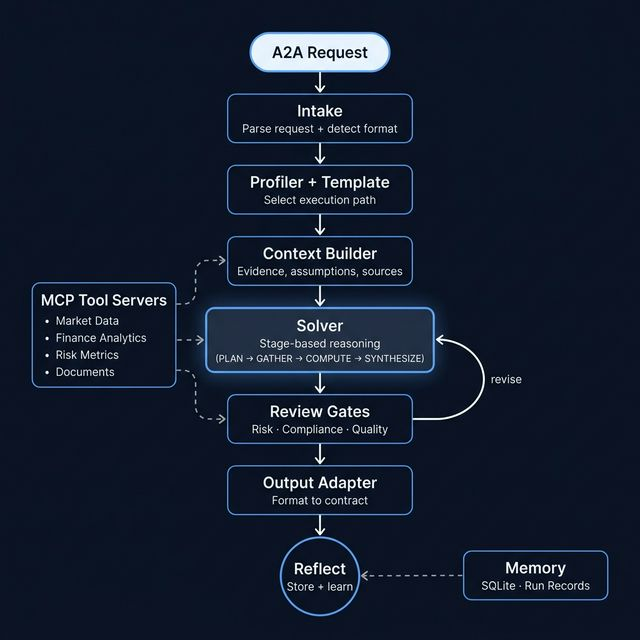

# CoreLink AI: Autonomous Finance Reasoning Engine

CoreLink AI is a high-precision, finance-first reasoning engine built on LangGraph and the Model Context Protocol (MCP). It is designed for autonomous Agent-to-Agent (A2A) benchmarks and complex financial research tasks that require structured evidence, multi-step planning, and rigorous self-reflection.

## 🎯 Overview

CoreLink AI is a modular system that treats every request as a structured research task. It excels in scenarios where a plain chat workflow is insufficient: quantitative finance, options strategy analysis, portfolio risk review, event-driven finance, document-backed reasoning, and policy-constrained recommendations.

## 🏗️ Technical Architecture



CoreLink AI follows a modular, stage-based architecture driven by a state-controlled graph. Each request passes through a specialized pipeline designed to maximize accuracy and minimize hallucinations.

### Core Components

- **Intake & Task Profiling**: Automatically identifies the financial domain (Quant, Options, Risk, etc.) and rotates the internal model profile to match the task complexity.
- **Autonomous Capability Engine (ACE)**: The system's dynamic expansion layer. ACE synthesizes runtime-specific helper scripts in a secure sandbox when task requirements exceed the static tool registry.
- **Reasoning Brain (URE)**: A multi-agent LangGraph system that orchestrates planning, evidence gathering, and synthesis into a final analytical artifact.
- **Context Curator**: High-resolution evidence aggregator that extracts data from prompts, documents, and tool outputs while maintaining strict provenance.
- **Reflective Reviewer**: A final validation gate that inspects answers against original constraints, performing automated backtracking and repair if needed.

## 💎 Handling Finance Complexity

Finance tasks involve uncertainty, exact computation, risk tradeoffs, and policy constraints. CoreLink AI addresses these by:

- **Structured Evidence**: Using market, document, and analytics tools instead of relying on free-form model recall.
- **Phase Separation**: Explicitly separating evidence gathering from reasoning and final answer generation.
- **Risk & Compliance Gates**: Running safety checks on actionable finance paths before final output.
- **Assumed Transparency**: Keeping assumptions and sources explicit throughout the execution trace.

## 💼 Supported Workloads

- **Quantitative Finance**: Market-data-backed analysis and metric derivation.
- **Options Strategies**: Detailed strategy analysis with Greeks and risk scenarios.
- **Portfolio Risk**: Policy-aware recommendations and risk limit reviews.
- **Event-Driven Analysis**: Equity research and reaction analysis for financial events.
- **Document-Grounded QA**: High-fidelity reasoning backed by financial filings (10-K, 10-Q, etc.).

## 🚀 Getting Started

### Prerequisites

- [uv](https://github.com/astral-sh/uv) (recommended) or Python 3.13+
- Your preferred OpenAI-compatible API key (e.g., Nebius, Groq, OpenAI)

### Installation

1.  **Clone the repository**:
    ```bash
    git clone https://github.com/your-username/CoreLink-AI.git
    cd CoreLink-AI
    ```

2.  **Initialize the environment**:
    ```bash
    uv sync
    ```

3.  **Configure Environment Variables**:
    ```bash
    cp .env.example .env
    # Edit .env with your API keys and model preferences
    ```

4.  **Start the A2A Server**:
    ```bash
    uv run src/server.py --port 9009
    ```

## 🧪 Validation & Testing

Run the full test suite to verify A2A compliance:

```bash
uv run pytest tests/
```

### Smoke Tests

- **Deterministic Logic**: `uv run pytest tests/test_engine_runtime.py -q`
- **Live LLM Reasoning**: `uv run python scripts/run_live_engine_smoke.py`
- **Stateless Benchmark Mode**: `BENCHMARK_STATELESS=1 uv run python scripts/run_benchmark_stateless_smoke.py`

## 🛠️ Project Structure

- `src/server.py`: A2A Starlette server entrypoint.
- `src/executor.py`: Bridge between A2A requests and the Reasoning Brain.
- `src/agent/`: Core engine implementation (Graph, Nodes, Solver).
- `src/mcp_servers/`: Local Model Context Protocol server implementations.
- `docs/`: Technical specifications, milestone reports, and design docs.

---
*Autonomous Finance Reasoning Engine*
